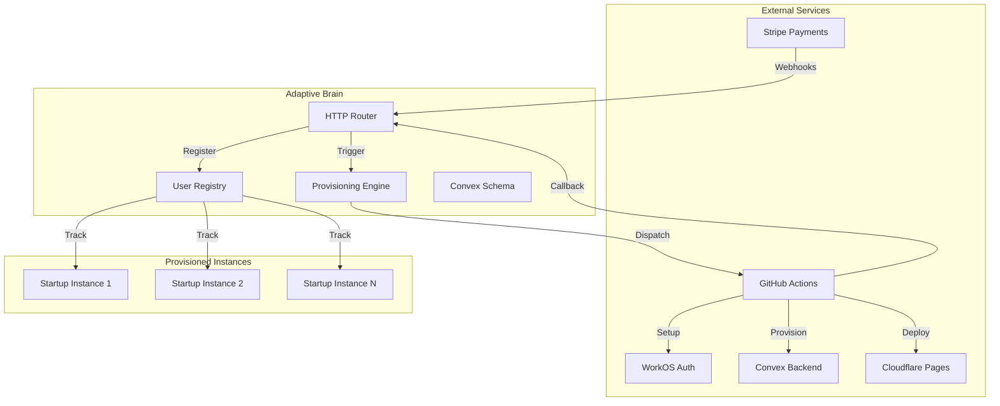
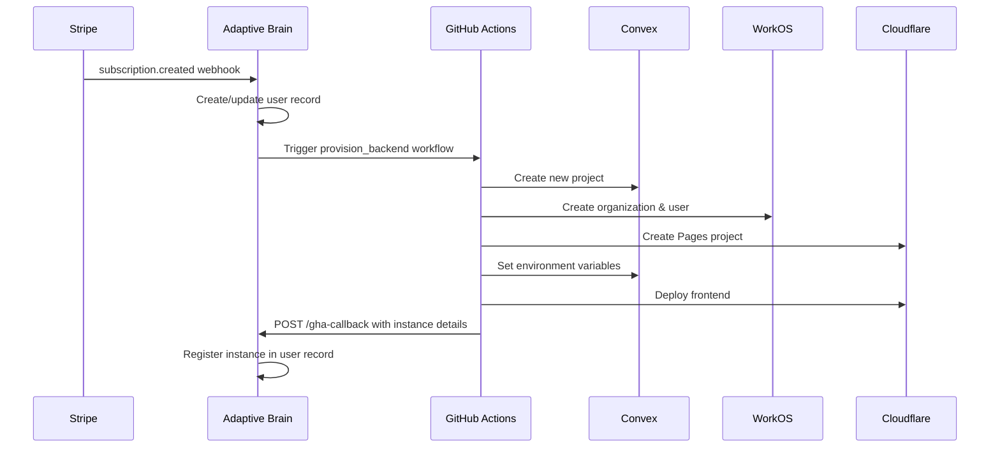

# Adaptive Brain - Control Plane & Provisioning Engine

**Adaptive Brain** is the central control plane and orchestration layer for the Adaptive Startup platform. It manages multi-tenant provisioning, user lifecycle, subscription management, and serves as the "brain" that coordinates backend infrastructure across Convex, WorkOS, Stripe, and Cloudflare.

---

## Table of Contents

- [Architecture Overview](#architecture-overview)
- [Core Responsibilities](#core-responsibilities)
- [Technology Stack](#technology-stack)
- [Directory Structure](#directory-structure)
- [Data Model](#data-model)
- [Provisioning Pipeline](#provisioning-pipeline)
- [API Endpoints](#api-endpoints)
- [Scripts](#scripts)
- [Environment Variables](#environment-variables)
- [Deployment](#deployment)
- [Development Workflow](#development-workflow)

---

## Architecture Overview



**Adaptive Brain** acts as the **single source of truth** for:
- User accounts and subscription status
- Provisioned backend instances (Convex deployments)
- WorkOS organizations and user mappings
- Stripe customer and subscription data

---

## Core Responsibilities

### 1. **Subscription Management**
- Receives Stripe webhook events (`customer.subscription.created`, `customer.subscription.updated`, `customer.subscription.deleted`)
- Creates or updates user records in the Convex database
- Triggers provisioning workflows for new subscriptions
- Suspends instances when subscriptions are canceled

### 2. **Multi-Tenant Provisioning**
- Orchestrates GitHub Actions workflows to provision dedicated infrastructure for each customer
- Creates isolated Convex backends, WorkOS organizations, and Cloudflare deployments
- Registers provisioned instances back to the control plane via callback

### 3. **User & Organization Registry**
- Maintains a centralized registry of all users and their provisioned instances
- Tracks WorkOS organization IDs and user IDs for identity management
- Maps Stripe customer IDs to internal user records

### 4. **Instance Lifecycle Management**
- Monitors the status of provisioned instances (`provisioning`, `active`, `suspended`)
- Provides APIs for querying user instances and their health

---

## Technology Stack

| Component | Technology | Purpose |
|-----------|-----------|---------|
| **Backend** | Convex | Serverless backend with real-time data sync |
| **Authentication** | WorkOS | Enterprise-grade SSO and user management |
| **Payments** | Stripe | Subscription billing and payment processing |
| **Hosting** | Cloudflare Pages | Frontend deployment for provisioned instances |
| **Orchestration** | GitHub Actions | CI/CD and provisioning automation |
| **Language** | TypeScript/JavaScript | Type-safe development |

---

## Directory Structure

```
apps/adaptive-brain/
├── convex/                    # Convex backend functions
│   ├── schema.ts              # Database schema definition
│   ├── http.ts                # HTTP routes (webhooks, callbacks)
│   ├── provisioning.ts        # Provisioning logic and mutations
│   ├── users.ts               # User management functions
│   └── _generated/            # Auto-generated Convex types
├── scripts/                   # Provisioning automation scripts
│   ├── provision_backend.cjs  # Creates Convex projects
│   ├── setup_workos.cjs       # Configures WorkOS orgs and users
│   ├── setup_stripe_webhooks.cjs # Registers Stripe webhooks
│   └── setup_cloudflare.cjs   # Creates Cloudflare Pages projects
├── .env.local                 # Local environment variables
├── .env.production            # Production environment variables
└── package.json               # Dependencies and scripts
```

---

## Data Model

### `users` Table

| Field | Type | Description |
|-------|------|-------------|
| `email` | `string` | User's email address (indexed) |
| `name` | `string?` | User's full name |
| `stripeCustomerId` | `string?` | Stripe customer ID (indexed) |
| `subscriptionStatus` | `string?` | Current subscription status (`pro`, `enterprise`, etc.) |
| `orgId` | `string?` | Primary WorkOS organization ID |
| `workosUserId` | `string?` | WorkOS user ID |
| `instances` | `array?` | Array of provisioned instances |

### `instances` Object Schema

| Field | Type | Description |
|-------|------|-------------|
| `instanceUrl` | `string` | Convex deployment URL |
| `projectSlug` | `string` | Convex project slug/name |
| `orgId` | `string?` | WorkOS org ID for this instance |
| `workosUserId` | `string?` | WorkOS user ID for this instance |
| `plan` | `string` | Subscription plan (`pro`, `enterprise`) |
| `status` | `string` | Instance status (`provisioning`, `active`, `suspended`) |
| `createdAt` | `number` | Unix timestamp of creation |

### `stripeEvents` Table

| Field | Type | Description |
|-------|------|-------------|
| `eventId` | `string` | Stripe event ID (indexed) |
| `eventType` | `string` | Event type (e.g., `customer.subscription.created`) |
| `customerId` | `string?` | Stripe customer ID (indexed) |
| `customerEmail` | `string?` | Customer email address |
| `subscriptionId` | `string?` | Stripe subscription ID |
| `payload` | `any` | Full Stripe event payload |
| `processedAt` | `number` | Unix timestamp when processed |

### `provisioningJobs` Table

| Field | Type | Description |
|-------|------|-------------|
| `email` | `string` | User email (indexed) |
| `userId` | `string?` | Internal user ID |
| `plan` | `string` | Subscription plan |
| `subscriptionId` | `string?` | Stripe subscription ID |
| `status` | `string` | Job status: `pending`, `in_progress`, `completed`, `failed` (indexed) |
| `githubRunId` | `string?` | GitHub Actions run ID |
| `instanceUrl` | `string?` | Provisioned instance URL |
| `projectSlug` | `string?` | Convex project slug |
| `error` | `string?` | Error message if failed |
| `createdAt` | `number` | Creation timestamp |
| `updatedAt` | `number` | Last update timestamp |

---

## Provisioning Pipeline

The provisioning pipeline is a multi-step process orchestrated by GitHub Actions:



### Workflow Steps

1. **Stripe Webhook** → Brain receives `customer.subscription.created`
2. **User Creation** → Brain creates/updates user in database
3. **GitHub Dispatch** → Brain triggers `provision_backend` workflow
4. **Convex Provisioning** → Creates isolated Convex project via Management API
5. **WorkOS Setup** → Creates organization and user
6. **Cloudflare Setup** → Creates Pages project with environment variables
7. **Deploy Key Creation** → Generates deploy key via Convex Management API
8. **Environment Variables** → Sets all required env vars via batch update API
9. **Code Deployment** → Deploys Convex functions and schema to new instance
10. **Frontend Build** → Builds and deploys React app to Cloudflare Pages
11. **Callback** → GitHub Actions notifies Brain with instance details
12. **Registration** → Brain registers instance in user's record

**Note:** The Brain control plane has ONE Stripe webhook for all subscriptions. Individual instances do NOT have separate Stripe webhooks - all payment events flow through the Brain.

---

## API Endpoints

### `POST /stripe-webhook`

Handles Stripe webhook events for subscription lifecycle management.

**Events Handled:**
- `customer.subscription.created` - Triggers provisioning
- `customer.subscription.updated` - Updates subscription status
- `customer.subscription.deleted` - Suspends instances

**Request:**
```http
POST /stripe-webhook
Stripe-Signature: <signature>

{
  "type": "customer.subscription.created",
  "data": {
    "object": {
      "id": "sub_xxx",
      "customer": "cus_xxx",
      "customer_email": "user@example.com"
    }
  }
}
```

**Response:**
```http
200 OK
```

---

### `POST /gha-callback`

Receives provisioning completion callbacks from GitHub Actions.

**Request:**
```http
POST /gha-callback
Content-Type: application/json

{
  "email": "user@example.com",
  "instanceUrl": "https://happy-animal-123.convex.cloud",
  "projectSlug": "startup-abc123-4567",
  "orgId": "org_01H...",
  "workosUserId": "user_01H...",
  "plan": "pro"
}
```

**Response:**
```http
200 OK
```

**Side Effects:**
- Registers instance in user's `instances` array
- Updates user's `orgId` and `workosUserId` if not already set
- Marks instance status as `active`

---

### `GET /user-data`

Queries user information by email for GitHub Actions workflows.

**Request:**
```http
GET /user-data?email=user@example.com
```

**Response:**
```http
200 OK
Content-Type: application/json

{
  "email": "user@example.com",
  "name": "John Doe",
  "stripeCustomerId": "cus_xxx",
  "subscriptionStatus": "pro",
  "orgId": "org_01H...",
  "workosUserId": "user_01H...",
  "instances": [
    {
      "instanceUrl": "https://happy-animal-123.convex.cloud",
      "projectSlug": "startup-abc123-4567",
      "plan": "pro",
      "status": "active",
      "createdAt": 1234567890
    }
  ]
}
```

**Use Case:**
- GitHub Actions workflows can query user data to check provisioning status
- Allows workflows to make decisions based on user's current state

---

## Scripts

### `provision_backend.cjs`

Creates a new Convex project using the Management API.

**Environment Variables:**
- `CONVEX_TEAM_ID` - Convex team ID
- `CONVEX_TEAM_ACCESS_TOKEN` - Team access token
- `GH_EVENT_PAYLOAD` - GitHub event payload (JSON)

**Outputs:**
- `convex_url` - Deployment URL
- `convex_deployment_name` - Deployment name (e.g., `happy-animal-123`)
- `convex_project_slug` - Project slug/name

**Usage:**
```bash
node scripts/provision_backend.cjs
```

---

### `setup_workos.cjs`

Creates a WorkOS organization and user, sends invitation.

**Environment Variables:**
- `WORKOS_API_KEY` - WorkOS API key
- `GH_EVENT_PAYLOAD` - GitHub event payload (JSON)

**Outputs:**
- `workos_org_id` - Created organization ID
- `workos_user_id` - Created/found user ID

**Logic:**
1. Creates organization named `{name}'s Startup`
2. Lists existing users by email
3. Creates user if not found (with retry logic)
4. Sends invitation to join organization

**Usage:**
```bash
node scripts/setup_workos.cjs
```

---


### `setup_cloudflare.cjs`

Creates a Cloudflare Pages project and sets environment variables.

**Environment Variables:**
- `CLOUDFLARE_API_TOKEN` - Cloudflare API token
- `CLOUDFLARE_ACCOUNT_ID` - Cloudflare account ID
- `VITE_CONVEX_URL` - Convex deployment URL
- `VITE_WORKOS_ORG_ID` - WorkOS organization ID
- `VITE_WORKOS_CLIENT_ID` - WorkOS client ID
- `GH_EVENT_PAYLOAD` - GitHub event payload (JSON)

**Outputs:**
- `cloudflare_project_name` - Created project name

**Logic:**
1. Creates Cloudflare Pages project
2. Sets environment variables via API for production and preview
3. Returns project name for deployment

**Usage:**
```bash
node scripts/setup_cloudflare.cjs
```

---

### `configure_and_deploy.cjs`

Configures environment variables and deploys code to a newly provisioned Convex project using the Management API.

**Environment Variables:**
- `CONVEX_TEAM_ACCESS_TOKEN` - Team access token
- `PROJECT_ID` - Convex project ID (numeric)
- `PROJECT_SLUG` - Project slug/name
- `DEPLOYMENT_NAME` - Deployment name (e.g., `happy-animal-123`)
- `WORKOS_API_KEY` - WorkOS API key (required for code analysis)
- `WORKOS_ORG_ID` - WorkOS organization ID
- `WORKOS_CLIENT_ID` - WorkOS client ID
- `GEMINI_API_KEY` - Gemini API key

**Logic:**
1. Creates a deploy key via `POST /v1/deployments/:name/create_deploy_key`
2. Sets environment variables in batch via `POST https://:deployment.convex.cloud/api/v1/update_environment_variables`
3. Deploys code using `npx convex deploy` (without `--prod` flag) with the generated deploy key

**API Endpoints Used:**
- Deploy Key: `https://api.convex.dev/v1/deployments/{deploymentName}/create_deploy_key`
- Environment Variables: `https://{deploymentName}.convex.cloud/api/v1/update_environment_variables`

**Usage:**
```bash
cd apps/adaptive-startup
node ../adaptive-brain/scripts/configure_and_deploy.cjs
```

**Note:** This script replaces manual `convex env set` commands and handles authentication using dynamically generated deploy keys. The Convex CLI automatically detects prod vs preview based on the deploy key type.

---

### `test_stripe_webhook.cjs`

Test script to simulate Stripe webhook events and verify the complete provisioning pipeline.

**Environment Variables:**
- `BRAIN_CONVEX_URL` - Brain control plane URL (defaults to production)

**Logic:**
1. Sends simulated `customer.subscription.created` event to Brain
2. Waits for processing (3 seconds)
3. Queries `/user-data` endpoint to verify user was created
4. Displays next steps for monitoring GitHub Actions

**Usage:**
```bash
# Test with default production URL
node scripts/test_stripe_webhook.cjs

# Test with custom Brain URL
BRAIN_CONVEX_URL=https://your-brain.convex.site node scripts/test_stripe_webhook.cjs
```

**Use Case:**
- End-to-end testing of Stripe webhook → Brain → GitHub Actions flow
- Verifying provisioning pipeline without requiring real Stripe payments
- Debugging webhook processing and user data storage

**Expected Result:**
When successful, the complete provisioning flow takes approximately 2-3 minutes and creates:
- New Convex project with deployed backend code
- WorkOS organization and user
- Cloudflare Pages deployment
- User record in Brain with instance details

---

## Complete Provisioning Flow

The end-to-end provisioning flow is fully automated and takes approximately 2-3 minutes:

### Successful Flow Indicators

✅ **Stripe Webhook Received** - Brain logs show event processed
✅ **User Created** - User record created/updated in Brain database
✅ **GitHub Actions Triggered** - Workflow run starts within 5 seconds
✅ **Convex Backend Provisioned** - New project created via Management API
✅ **WorkOS Setup Complete** - Organization and user created
✅ **Cloudflare Project Created** - Pages project configured
✅ **Backend Configured** - Deploy key generated, env vars set, code deployed
✅ **Frontend Deployed** - React app built and deployed to Cloudflare
✅ **Brain Notified** - Instance registered back to control plane

### Monitoring Provisioning

```bash
# Trigger test payment
node apps/adaptive-brain/scripts/test_stripe_webhook.cjs

# Monitor GitHub Actions
gh run list --repo TEKIMAX/adaptive-monorepo --workflow provision_backend.yml --limit 1
gh run watch <run-id> --repo TEKIMAX/adaptive-monorepo

# Check Brain database
# Visit Convex dashboard to see user record and instance details
```

---

## Environment Variables

### Required for Development

```bash
# Convex
CONVEX_TEAM_ID=123456
CONVEX_TEAM_ACCESS_TOKEN=eyJ2MiI6...

# WorkOS
WORKOS_API_KEY=sk_test_...
WORKOS_CLIENT_ID=client_...

# Stripe
STRIPE_SECRET_KEY=sk_test_...
STRIPE_WEBHOOK_SECRET=whsec_...

# Cloudflare
CLOUDFLARE_API_TOKEN=...
CLOUDFLARE_ACCOUNT_ID=...

# GitHub (for provisioning)
GITHUB_ACCESS_TOKEN=ghp_...
GITHUB_OWNER=TEKIMAX
GITHUB_REPO=adaptive-monorepo

# Brain Control Plane
CONVEX_SITE_URL=https://outstanding-goldfinch-979.convex.site
BRAIN_CONVEX_URL=https://outstanding-goldfinch-979.convex.site
CONVEX_URL=https://outstanding-goldfinch-979.convex.cloud
CONVEX_DEPLOYMENT=dev:outstanding-goldfinch-979

# AI
GEMINI_API_KEY=AIzaSy...
```

### GitHub Secrets (for Actions)

All of the above variables must be configured as GitHub repository secrets in the **"Provisioning User Account"** environment for the provisioning workflow to function:

**Required Secrets:**
- `CONVEX_TEAM_ID` - Team ID for creating projects
- `CONVEX_TEAM_ACCESS_TOKEN` - Team access token for Management API
- `WORKOS_API_KEY` - Required for WorkOS operations and code analysis
- `WORKOS_CLIENT_ID` - WorkOS client application ID
- `STRIPE_SECRET_KEY` - Stripe API key for webhook verification
- `CLOUDFLARE_API_TOKEN` - Cloudflare API token for Pages deployment
- `CLOUDFLARE_ACCOUNT_ID` - Cloudflare account ID
- `BRAIN_CONVEX_URL` - Brain control plane URL (e.g., `https://outstanding-goldfinch-979.convex.site`)
- `BRAIN_DEPLOY_KEY` - Deploy key for Brain (optional, for direct mutations)
- `GEMINI_API_KEY` - Gemini API key for AI features

**Note:** The Brain webhook secret is stored in the Brain deployment's environment variables, not as a GitHub secret.

---

## Deployment

### Local Development

```bash
# Install dependencies
npm install

# Run Convex dev server
npx convex dev

# Deploy schema and functions
npx convex deploy
```

### Production Deployment

```bash
# Set production environment
export CONVEX_DEPLOYMENT=prod:adaptive-brain-123

# Deploy to production
npx convex deploy --prod
```

---

## Development Workflow

### Adding a New Provisioning Step

1. Create a new script in `scripts/` (e.g., `setup_new_service.cjs`)
2. Add the script to `.github/workflows/provision_backend.yml`
3. Update the `gha-callback` payload if new data needs to be tracked
4. Update the `users` schema if new fields are required
5. Test locally with mock GitHub event payloads

### Testing Provisioning Locally

```bash
# Set mock event payload
export GH_EVENT_PAYLOAD='{"client_payload":{"email":"test@example.com","userId":"test-123","plan":"pro"}}'

# Run individual scripts
node scripts/provision_backend.cjs
node scripts/setup_workos.cjs
node scripts/setup_stripe_webhooks.cjs
node scripts/setup_cloudflare.cjs
```

### Debugging Webhooks

Use the Convex dashboard logs to inspect incoming webhook payloads and function execution:

```
https://dashboard.convex.dev/t/<team>/adaptive-brain/logs
```

---

## Key Design Decisions

### Why Convex for the Control Plane?

- **Real-time sync** - Instant updates to user records and instance status
- **Serverless** - No infrastructure management
- **Type-safe** - Generated TypeScript types from schema
- **HTTP routes** - Built-in webhook handling

### Why GitHub Actions for Provisioning?

- **Auditability** - Full log history of every provisioning run
- **Reliability** - Automatic retries and error handling
- **Security** - Secrets management built-in
- **Flexibility** - Easy to add new provisioning steps

### Why Separate Instances per Customer?

- **Data isolation** - Each customer has their own Convex backend
- **Scalability** - No noisy neighbor problems
- **Customization** - Per-customer feature flags and configurations
- **Security** - Reduced blast radius for security incidents

---

## Recent Changes (January 2026)

### Architecture Improvements

**✅ Completed End-to-End Provisioning Flow**
- Fixed Convex Management API integration (deploy keys + environment variables)
- Removed per-instance Stripe webhooks (Brain has ONE webhook for all subscriptions)
- Added proper authentication with deploy keys
- Implemented batch environment variable updates
- Fixed Convex CLI compatibility (removed deprecated `--prod` flag)

**✅ Database Enhancements**
- Added `stripeEvents` table for complete audit trail
- Added `provisioningJobs` table for tracking provisioning status
- Implemented event deduplication

**✅ Improved Error Handling**
- Better error messages during provisioning failures
- Retry logic for WorkOS user creation
- Proper validation of required environment variables

### Testing Improvements

- Created `test_stripe_webhook.cjs` for end-to-end testing
- Added comprehensive troubleshooting documentation
- Verified complete flow: Stripe → Brain → GitHub Actions → Deployed Instance

---

## Future Enhancements

- [ ] Add health check endpoints for provisioned instances
- [ ] Implement automatic instance scaling based on usage
- [ ] Add support for custom domains per instance
- [ ] Implement instance backup and restore
- [ ] Add usage metering and analytics
- [ ] Support for instance migrations between regions
- [ ] Add automatic cleanup of failed provisioning attempts
- [ ] Implement provisioning job retries for transient failures

---

## Troubleshooting

### Provisioning Fails at Convex Step

**Symptom:** `ReferenceError: projectSlug is not defined`

**Solution:** Ensure `provision_backend.cjs` correctly defines `projectSlug` from `projectName`

### WorkOS User Creation Fails

**Symptom:** `UnprocessableEntityException: The following requirement must be met: undefined`

**Solution:** The script now handles this by only passing `email` and `emailVerified` to `createUser`

### Stripe Webhook Not Received

**Symptom:** No provisioning triggered after subscription creation

**Solution:**
1. Verify `STRIPE_WEBHOOK_SECRET` is set correctly in Brain deployment
2. Check Stripe dashboard for webhook delivery logs
3. Ensure `/stripe-webhook` endpoint is publicly accessible
4. Brain should have ONE webhook, not per-instance webhooks

### Deploy Key Creation Fails (404)

**Symptom:** `Failed to create deploy key: 404`

**Solution:** Use the correct API endpoint: `POST /v1/deployments/:deploymentName/create_deploy_key` (not `/api/projects/:projectId/deploy_keys`)

### Environment Variables Not Set (404)

**Symptom:** `Failed to set environment variables: 404`

**Solution:** Use deployment-specific URL: `https://{deploymentName}.convex.cloud/api/v1/update_environment_variables` with `Convex` prefix in Authorization header

### Convex Deploy Fails: "unknown option '--prod'"

**Symptom:** `error: unknown option '--prod'`

**Solution:** Remove the `--prod` flag. The Convex CLI automatically deploys to prod when using a prod deploy key.

### Code Deployment Fails: "Missing API key"

**Symptom:** `Uncaught Failed to analyze project_actions.js: Missing API key`

**Solution:** Add `WORKOS_API_KEY` to the environment variables being set during configuration. This is required for Convex to analyze the code during deployment.

### Brain Notification Fails: "URL rejected: Malformed input"

**Symptom:** `curl: (3) URL rejected: Malformed input to a URL function`

**Solution:** Ensure `BRAIN_CONVEX_URL` is set as a GitHub secret in the "Provisioning User Account" environment. Use `${BRAIN_CONVEX_URL}` instead of `${{ secrets.BRAIN_CONVEX_URL }}` in the curl command.

### Stripe Webhook Limit Reached

**Symptom:** `You have reached the maximum of 16 test webhook endpoints`

**Solution:** This occurs during development testing. The correct architecture has ONE webhook pointing to Brain, not per-instance webhooks. Delete old test webhooks from Stripe dashboard, or use production mode for real deployments.

---

## Contributing

When contributing to Adaptive Brain:

1. **Schema Changes** - Always update `schema.ts` and regenerate types
2. **Provisioning Scripts** - Test locally with mock payloads before deploying
3. **Webhooks** - Always validate signatures and handle errors gracefully
4. **Documentation** - Update this README when adding new features

---

## License

Proprietary - TEKIMAX LLC © 2026
