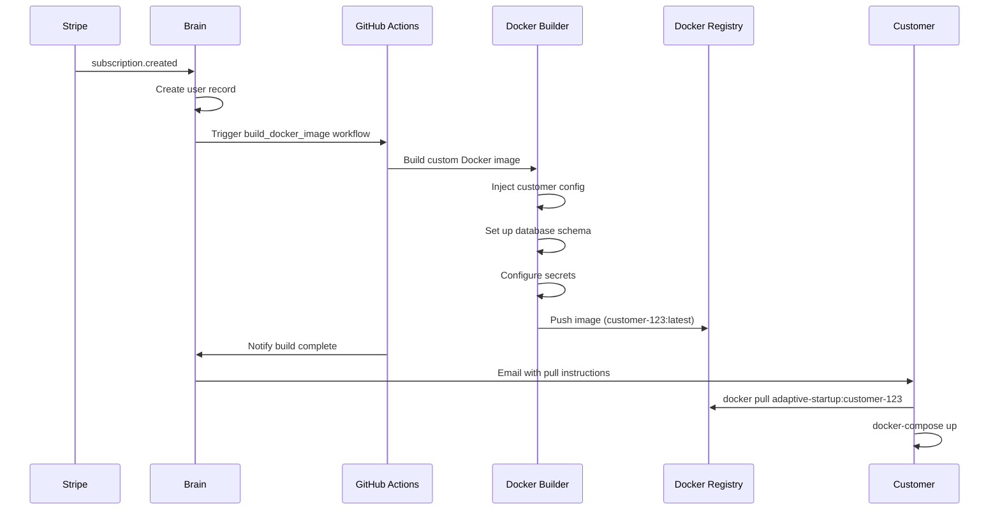

# Version 2.0.0: Docker Self-Hosted Edition

**Status:** Planning
**Branch:** TBD (future)
**Target Release:** Q2-Q3 2026
**Type:** Major Architecture Shift

---

## Vision

Transform Adaptive Startup from a cloud-only SaaS platform to a **hybrid cloud + self-hosted** solution where customers can:

1. **Pull a Docker image** specific to their provisioned instance
2. **Run it locally** on their own infrastructure (no internet required)
3. **Get the full application** - frontend + backend + database + auth
4. **Update easily** by pulling new image versions

---

## Current Architecture (v1.0.0)

### Cloud-Only Dependencies

```
┌─────────────────────────────────────────┐
│         Provisioned Instance            │
├─────────────────────────────────────────┤
│ Frontend: Cloudflare Pages (cloud)      │
│ Backend: Convex (cloud)                 │
│ Auth: WorkOS (cloud)                    │
│ Database: Convex DB (cloud)             │
│ Storage: Convex File Storage (cloud)    │
└─────────────────────────────────────────┘
```

**Problem:** All components are cloud-hosted. No self-hosted option exists for Convex or WorkOS.

---

## Proposed Architecture (v2.0.0)

### Self-Hosted Docker Stack

```
┌─────────────────────────────────────────┐
│      Docker Image (customer-123)        │
├─────────────────────────────────────────┤
│ Frontend: nginx + React SPA             │
│ Backend: Node.js + Express API          │
│ Auth: Keycloak / Auth.js                │
│ Database: PostgreSQL                    │
│ Storage: MinIO (S3-compatible)          │
│ Cache: Redis                            │
└─────────────────────────────────────────┘
```

**Benefits:**
- ✅ Fully self-contained
- ✅ No internet required after download
- ✅ Runs on any Docker host
- ✅ Customer controls all data
- ✅ No ongoing cloud costs

---

## Technical Requirements

### 1. Backend Migration: Convex → Self-Hosted

**Current:** Convex (cloud-only, proprietary)
**New:** Node.js + Express + PostgreSQL

#### Tasks

- [ ] **API Server** - Build Node.js/Express REST API
- [ ] **Database Schema** - Migrate Convex schema to PostgreSQL
- [ ] **Real-time** - Replace Convex subscriptions with WebSockets (Socket.io)
- [ ] **File Storage** - Replace Convex storage with MinIO
- [ ] **Functions** - Port all Convex functions to Express routes
- [ ] **Mutations** - Convert to REST endpoints with transactions
- [ ] **Queries** - Convert to GraphQL or REST endpoints

#### Key Files to Create

```
apps/adaptive-startup-selfhosted/
├── backend/
│   ├── src/
│   │   ├── api/
│   │   │   ├── auth.ts
│   │   │   ├── users.ts
│   │   │   ├── projects.ts
│   │   │   ├── metrics.ts
│   │   │   └── ai.ts
│   │   ├── db/
│   │   │   ├── schema.sql
│   │   │   ├── migrations/
│   │   │   └── client.ts
│   │   ├── websocket/
│   │   │   └── server.ts
│   │   ├── storage/
│   │   │   └── minio.ts
│   │   └── index.ts
│   ├── Dockerfile
│   └── package.json
```

---

### 2. Auth Migration: WorkOS → Self-Hosted

**Current:** WorkOS (cloud-only, enterprise SSO)
**Options:**
1. **Keycloak** - Full-featured, enterprise-grade
2. **Auth.js (NextAuth.js)** - Simpler, modern
3. **Supabase Auth** - Can be self-hosted

**Recommendation:** Auth.js for simplicity, with option to use Keycloak for enterprise

#### Tasks

- [ ] **Authentication Server** - Set up Auth.js
- [ ] **User Management** - Build user CRUD
- [ ] **Session Management** - JWT or database sessions
- [ ] **Password Reset** - Email-based flow (optional)
- [ ] **OAuth Support** - Google, GitHub (optional)
- [ ] **Organization Management** - Multi-tenant support

---

### 3. Frontend Adaptation

**Current:** React + Vite, deployed to Cloudflare Pages
**New:** Same React app, but served from nginx in Docker

#### Tasks

- [ ] **Build Optimization** - Production build with all assets
- [ ] **nginx Configuration** - Serve static files + proxy API
- [ ] **API Client** - Update to point to localhost backend
- [ ] **WebSocket Client** - Connect to local WebSocket server
- [ ] **Environment Config** - Runtime configuration for Docker

---

### 4. Database Layer

**New Component:** PostgreSQL for persistence

#### Schema Migration

```sql
-- Example: users table (migrated from Convex)
CREATE TABLE users (
    id UUID PRIMARY KEY DEFAULT gen_random_uuid(),
    email VARCHAR(255) UNIQUE NOT NULL,
    name VARCHAR(255),
    password_hash VARCHAR(255),
    stripe_customer_id VARCHAR(255),
    subscription_status VARCHAR(50),
    created_at TIMESTAMP DEFAULT NOW(),
    updated_at TIMESTAMP DEFAULT NOW()
);

-- Example: projects table
CREATE TABLE projects (
    id UUID PRIMARY KEY DEFAULT gen_random_uuid(),
    user_id UUID REFERENCES users(id) ON DELETE CASCADE,
    name VARCHAR(255) NOT NULL,
    description TEXT,
    status VARCHAR(50) DEFAULT 'active',
    data JSONB,
    created_at TIMESTAMP DEFAULT NOW(),
    updated_at TIMESTAMP DEFAULT NOW()
);

-- Indexes
CREATE INDEX idx_users_email ON users(email);
CREATE INDEX idx_projects_user_id ON projects(user_id);
```

---

### 5. Docker Compose Setup

**Multi-container orchestration**

```yaml
# docker-compose.yml
version: '3.8'

services:
  frontend:
    image: adaptive-startup-frontend:customer-123
    ports:
      - "80:80"
      - "443:443"
    depends_on:
      - backend
    networks:
      - adaptive-network

  backend:
    image: adaptive-startup-backend:customer-123
    environment:
      - DATABASE_URL=postgresql://postgres:password@db:5432/adaptive
      - REDIS_URL=redis://redis:6379
      - MINIO_ENDPOINT=minio:9000
      - JWT_SECRET=${JWT_SECRET}
      - GEMINI_API_KEY=${GEMINI_API_KEY}
    ports:
      - "3000:3000"
    depends_on:
      - db
      - redis
      - minio
    networks:
      - adaptive-network

  db:
    image: postgres:16
    environment:
      - POSTGRES_DB=adaptive
      - POSTGRES_USER=postgres
      - POSTGRES_PASSWORD=password
    volumes:
      - postgres_data:/var/lib/postgresql/data
      - ./init.sql:/docker-entrypoint-initdb.d/init.sql
    networks:
      - adaptive-network

  redis:
    image: redis:7-alpine
    volumes:
      - redis_data:/data
    networks:
      - adaptive-network

  minio:
    image: minio/minio
    command: server /data --console-address ":9001"
    environment:
      - MINIO_ROOT_USER=minioadmin
      - MINIO_ROOT_PASSWORD=minioadmin
    volumes:
      - minio_data:/data
    ports:
      - "9000:9000"
      - "9001:9001"
    networks:
      - adaptive-network

volumes:
  postgres_data:
  redis_data:
  minio_data:

networks:
  adaptive-network:
    driver: bridge
```

---

## Provisioning Flow v2.0.0

### New Provisioning Pipeline



### Provisioning Steps

1. **Stripe Webhook** → Brain receives subscription
2. **User Creation** → Brain creates user record
3. **GitHub Actions** → Trigger `build_docker_image.yml`
4. **Build Process:**
   - Clone adaptive-startup-selfhosted
   - Inject customer-specific configuration
   - Build frontend (Vite build)
   - Build backend (TypeScript compile)
   - Create PostgreSQL init script with customer data
   - Generate docker-compose.yml with customer secrets
   - Build Docker images
   - Tag: `adaptive-startup-customer-123:v1.0.0`
5. **Push to Registry** → Docker Hub / GitHub Container Registry
6. **Notify Customer** → Email with:
   - Docker pull command
   - docker-compose.yml download
   - Setup instructions
   - License key

---

## Customer Experience

### Installation Process

**Step 1: Receive Email**
```
Subject: Your Adaptive Startup Instance is Ready!

Hello,

Your self-hosted Adaptive Startup instance has been provisioned and is ready to use.

Docker Image: ghcr.io/tekimax/adaptive-startup:customer-abc123

Follow the instructions below to get started...
```

**Step 2: Pull Image**
```bash
# Authenticate with registry
docker login ghcr.io -u customer-abc123 -p <token>

# Pull the image
docker pull ghcr.io/tekimax/adaptive-startup:customer-abc123

# Download docker-compose.yml
curl -O https://provision.adaptivestartup.io/compose/customer-abc123
```

**Step 3: Configure**
```bash
# Create .env file
cat > .env << EOF
JWT_SECRET=$(openssl rand -hex 32)
GEMINI_API_KEY=your-api-key-here
DOMAIN=localhost
EOF
```

**Step 4: Start**
```bash
# Start all services
docker-compose up -d

# Wait for services to be ready
docker-compose ps

# Access application
open http://localhost
```

**Step 5: Login**
```
Default Admin:
Email: admin@customer-abc123.adaptive.local
Password: (sent in email)
```

---

## Hybrid Architecture Option

### Cloud Control Plane + Self-Hosted Instances

For customers who want self-hosted but still need cloud management:

```
┌─────────────────────────────────────────────┐
│          Brain (Cloud Control Plane)        │
│  - License management                       │
│  - Update distribution                      │
│  - Telemetry (optional)                     │
│  - Support portal                           │
└─────────────────────────────────────────────┘
                    │
        ┌───────────┴───────────┐
        │                       │
┌───────▼─────────┐   ┌────────▼────────┐
│  Customer A     │   │  Customer B     │
│  (On-Premises)  │   │  (On-Premises)  │
│                 │   │                 │
│  Docker Stack   │   │  Docker Stack   │
│  - Frontend     │   │  - Frontend     │
│  - Backend      │   │  - Backend      │
│  - Database     │   │  - Database     │
└─────────────────┘   └─────────────────┘
```

**Benefits:**
- Customers get self-hosted deployment
- Brain still manages licenses and updates
- Optional telemetry for support
- Easier update distribution

---

## Challenges & Solutions

### Challenge 1: AI API Keys

**Problem:** Gemini API requires internet connection
**Solutions:**
1. Customer provides their own API key
2. Bundle open-source model (Ollama)
3. Optional cloud proxy through Brain

### Challenge 2: Updates & Patches

**Problem:** How to update customer Docker images
**Solutions:**
1. Customer pulls new image versions manually
2. Auto-update via watchtower
3. Brain notifies of updates via webhook

### Challenge 3: Database Migrations

**Problem:** Schema changes need to be applied
**Solutions:**
1. Include migration tool in image (like Flyway)
2. Auto-run migrations on startup
3. Backup before migration

### Challenge 4: License Management

**Problem:** Prevent unauthorized distribution
**Solutions:**
1. Docker image requires license key activation
2. Phone-home for license validation (optional)
3. Time-limited trial keys
4. Hardware fingerprinting

---

## Implementation Roadmap

### Phase 1: Foundation (4-6 weeks)

- [ ] Create `adaptive-startup-selfhosted` monorepo app
- [ ] Set up PostgreSQL schema
- [ ] Build basic Node.js API
- [ ] Port core Convex functions
- [ ] Set up Auth.js
- [ ] Create base Dockerfiles

### Phase 2: Feature Parity (6-8 weeks)

- [ ] Port all Convex functions
- [ ] Implement WebSocket real-time updates
- [ ] Set up MinIO file storage
- [ ] Build all API endpoints
- [ ] Update frontend API client
- [ ] Full feature testing

### Phase 3: Docker Orchestration (2-3 weeks)

- [ ] Create docker-compose setup
- [ ] Build provisioning pipeline
- [ ] Set up Docker registry
- [ ] Create build automation
- [ ] Generate customer-specific images

### Phase 4: Customer Onboarding (2-3 weeks)

- [ ] Write installation documentation
- [ ] Create setup scripts
- [ ] Build license management
- [ ] Email notification templates
- [ ] Support portal

### Phase 5: Testing & QA (3-4 weeks)

- [ ] Integration testing
- [ ] Load testing
- [ ] Security audit
- [ ] Customer beta testing
- [ ] Documentation review

**Total Timeline:** 5-6 months

---

## Deployment Options

### Option 1: Single Instance (Small Business)

```bash
# Simple single-container deployment
docker run -d \
  -p 80:80 \
  -e DATABASE_URL=sqlite:///data/adaptive.db \
  -v adaptive-data:/data \
  ghcr.io/tekimax/adaptive-startup:customer-abc123
```

### Option 2: Full Stack (Medium Business)

```bash
# Full docker-compose with all services
docker-compose up -d
```

### Option 3: Kubernetes (Enterprise)

```yaml
# Kubernetes deployment
apiVersion: apps/v1
kind: Deployment
metadata:
  name: adaptive-startup
spec:
  replicas: 3
  selector:
    matchLabels:
      app: adaptive-startup
  template:
    metadata:
      labels:
        app: adaptive-startup
    spec:
      containers:
      - name: frontend
        image: ghcr.io/tekimax/adaptive-startup:customer-abc123
        ports:
        - containerPort: 80
```

---

## Pricing Model

### Cloud vs Self-Hosted

**Cloud (Current):**
- $29/month per instance
- We handle hosting, updates, support
- Pay-as-you-grow

**Self-Hosted (New):**
- $99/month license fee
- Customer handles hosting
- Unlimited users on their infrastructure
- Enterprise pricing for multi-site

**Hybrid:**
- $49/month base + $10/additional instance
- Best of both worlds

---

## Migration Path for Existing Customers

### From v1.0 (Cloud) to v2.0 (Self-Hosted)

1. **Export Data** - Download all user data from Convex
2. **Generate Docker Image** - Build customer-specific image
3. **Import Data** - Seed PostgreSQL with exported data
4. **Parallel Run** - Test self-hosted while cloud is active
5. **Cutover** - Switch DNS/redirect to self-hosted
6. **Decommission Cloud** - After confirmation

---

## Success Metrics

### v2.0.0 KPIs

- **Self-Hosted Adoption Rate:** >30% of new customers
- **Installation Success Rate:** >95% complete setup successfully
- **Support Ticket Reduction:** <10% increase (despite complexity)
- **Customer Satisfaction:** >90% prefer self-hosted option
- **Time to Production:** <30 minutes from pull to running

---

## Alternatives Considered

### Option A: Keep Convex + WorkOS (Cloud Only)

**Pros:** No migration work
**Cons:** Can't offer self-hosted

### Option B: Hybrid (Cloud Backend + Local Frontend)

**Pros:** Easier migration
**Cons:** Still requires internet, defeats purpose

### Option C: Full Rewrite (Different Framework)

**Pros:** Clean slate, modern stack
**Cons:** Months of work, risk of bugs

**Decision:** Option in this doc (PostgreSQL + Auth.js) strikes best balance

---

## Questions to Answer

- [ ] Which Docker registry? (Docker Hub, GitHub Container Registry, AWS ECR)
- [ ] How to handle API keys for AI features?
- [ ] License model (per-instance, per-user, per-server)?
- [ ] Support model for self-hosted?
- [ ] Update frequency and mechanism?
- [ ] How to handle security patches?

---

## Next Steps

1. **Validate with Customers** - Survey interest in self-hosted
2. **Prototype** - Build minimal viable Docker stack
3. **Cost Analysis** - Calculate development cost
4. **Create Detailed Specs** - Break down into sprints
5. **Decide Go/No-Go** - Based on customer demand

---

**Last Updated:** January 28, 2026
**Document Owner:** TEKIMAX Engineering Team
**Status:** Proposal - Requires Approval
